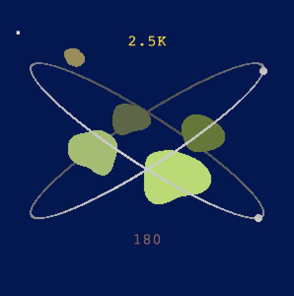
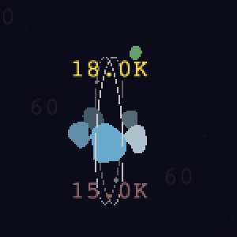
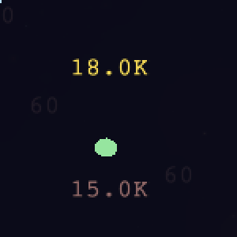
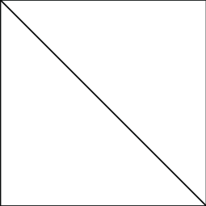
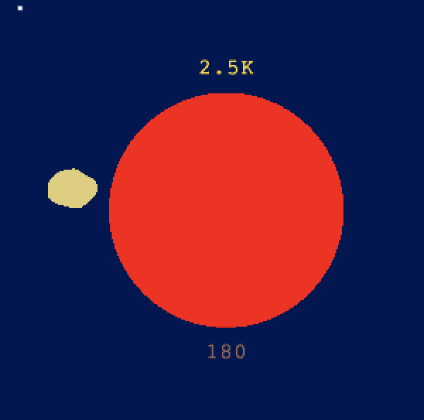

# Pluginnable Renderers

This article is about creating custom renderers for Dark Forest through the use of our plugin system.

# Background

Dark Forest uses WebGL to visualize the game. WebGL is a JavaScript API that is used for rendering high-performance 3D graphics.

Only certain browsers support WebGL. Click here to check: https://get.webgl.org/WebGL/.

Click here to Learn more about WebGL: https://WebGLfundamentals.org/webgl/lessons/webgl-getting-WebGL.html

# What is a Renderer

Renderers are classes that are used to draw specific types of entities such as planets or asteroids onto the Dark Forest game canvas. Custom made renderers can be passed into the Dark Forest API to replace the current renderer for that entity type.

Renderers have two main methods:

- Queue (a method that starts with `queue` followed by the name of the object it's rendering): The game calls the queue method for each instance of an object specified by the renderer type and accepts as an input any information relevant to the object. This information is then added to some implementation of a queue within the renderer for later use in the flush method.

- Flush: Flush is called every frame in the game. When called, the entities in the queue should be rendered onto the game canvas and the queue cleared.

For the game to recognize if the class is a renderer, it has to follow one of the renderer interfaces that can be found in `@darkforest_eth/types`

For instance `MineRendererType` is an interface for mine renderers. Mine renderers are used to draw Asteroid Fields which is a type of planet (not to be confused with Asteroids).



The `MineRendererType` has 2 abstract methods:

- `queueMine` is called by the game to queue an Asteroid Field to be drawn. The method has 3 parameters:
  - `planet`: A Planet object that contains information about the current Asteroid Field
  - `centerW`: a set of x and y coordinates that represent the position of the center of the Asteroid Field relative to the game world.
  - `radiusW`: the size of the Asteroid Field relative to the game world.
- `flush` called by the game to draw all queued up Asteroid Field.

Here is Dark Forest's current implementation of its mine renderer: https://github.com/darkforest-eth/packages/blob/master/renderer/src/Entities/MineRenderer.ts

## Draw Order

### The Order in Which Renderer Managers and Renderers Are Flushed

1. Background
   - Unmined
   - Space
2. Capture Zones
3. Line Renderer
4. Planet Manager
   - Planet
   - Asteroid
   - Mine
   - Spacetime Rip
   - Ruins
   - Ring
   - Quasar
   - Black Domain
5. UI
6. Voyager
7. Wormhole
8. Circle
9. Rect
10. Text
11. Sprite (Artifacts)

### When Multiple Renderers Implementing the Same Interface Are Passed Into the API:

When you replace a renderer in the game, the renderer is then put on our rendering stack. The rendering stack is used to determine which renderer to use if multiple renderers loaded for the same entity at the same time. The game will use the top most renderer. A renderer at any position in the stack can be popped.

# Example Plugin

We will run through the creation of a renderer that will replace the renderer for Asteroid Fields.

To create a renderer it has to follow one of the renderer interfaces that can be found in ​​`@darkforest_eth/types`. For the Asteroid Fields, we will be using the `MineRendererType`.

```javascript
import { RendererType } from 'https://cdn.skypack.dev/@darkforest_eth/types';

class GenericMineRenderer {
  constructor() {
    this.rendererType = RendererType.Mine;
  }

  queueMine(planet, centerW, radiusW) {}

  flush() {}
}
```

After implementing the interface the code should look similar to the code above. The code above can be considered a fully functional renderer. The resulting behavior would be as if you were disabling the renderer for the Asteroid Renderer.

Before:



After:



If you noticed in the queue function, the coordinate of the planet and the size of planet is relative to the game world. However when drawn on the canvas, the size and location of planet change based on the position of the players camera. We provide developers a way to easily transform between coordinate systems via the viewport class. You can get the viewport from the global ui class. `ui.getViewport()`. An example of the use of the viewport can be seen in the code of the `queueMine` function below.

```javascript
import { RendererType } from 'https://cdn.skypack.dev/@darkforest_eth/types';

class GenericMineRenderer {
  constructor() {
    this.viewport = ui.getViewport();
    this.rendererType = RendererType.Mine;
  }

  queueMine(planet, centerW, radiusW) {
    const centerCanvas = this.viewport.worldToCanvasCoords(centerW);
    const rCanvas = this.viewport.worldToCanvasDist(radiusW);
  }

  flush() {}
}
```

The `Viewport` class is used to translate between game world and canvas for distances and coordinates: https://github.com/darkforest-eth/packages/blob/master/types/interfaces/GameViewport.md

These are the 2 functions used above.

- `worldToCanvasCoords` will translate from game world coordinates to canvas coordinates. In the code above we are translating the location of the Asteroid Field to its location relative to the canvas.
- `worldToCanvasDist` will translate a distance relative to the game world to the pixel distance on the canvas.

After implementing the above code you should be ready to start implementing code that will draw on the game canvas.  
To do this you will need to be able to access the `WebGLRenderingContext`.

## WebGL Code

The next few sections will be about writing the WebGL Code.

We will be creating WebGL code that renders a circle instead of the original asteroid field. The color of the asteroid field while change based on the current energy level of the planet. The RGB value of the color is determined by this equation `red: 255 green: 255/(energy cap) \*(current energy) blue: 0`.

The goal of this section is to give you a basic understanding of how the WebGL code works. If you want to dive deeper into WebGL check out this website:

https://WebGLfundamentals.org/webgl/lessons/webgl-how-it-works.html

## Definitions

Clip space: The 3D coordinate system used by WebGL for its canvas. All coordinates range fro`m -1 to 1.

Vertex shader: The vertex shader is used to determine the location of a vertex on the WebGL clip space. WebGL will draw a shape onto the canvas based on the passed in vertices. For instance, the triangle draw mode will connect every 3 consecutive vertices to create a triangle.

Fragment Shader: Once a shape is created, the fragment shader is used to determine the color of each individual pixel in the shape.

Attribute Variables: The attributes are values that are passed in from outside the shader program to the vertex shader. Each vertex has its on set of attribute variables.

Uniform Variables: The uniforms are effectively global variables you set before the execution of the program. All vertices share the same uniform variables.

Varying Variables: Variables that will be transferred to be used in the fragment shader

The code below contains all of the objects that we will explore to demonstrate WebGL rendering. The two shaders are wrapped into a RendererProgram class. The RendererProgram is how the Dark Forest team structures our code. You do not have to follow this structure to create a working WebGL Program.

## Fragment and Vertex Shaders

```javascript
import { glsl } from 'https://cdn.skypack.dev/@darkforest_eth/renderer';
import {
  RendererProgram,
  AttribeType,
  UniformType,
} from 'https://cdn.skypack.dev/@darkforest_eth/types';
const program = {
  uniforms: {
    matrix: { name: 'u_matrix', type: UniformType.Mat4 },
  },
  attribs: {
    position: {
      dim: 4,
      type: AttribType.Float,
      normalize: false,
      name: 'a_position', //the name of the attribute variable
    },
    energyInfo: {
      dim: 2,
      type: AttribType.Float,
      normalize: false,
      name: 'a_energy',
    },
  },
  vertexShader: glsl`
        in vec4 a_position;
        in vec2 a_energy;
        uniform mat4 u_matrix;

        out vec2 v_rectPos;
        out float v_energy;
        out float v_energy_cap;
        void main() {
            // converting from canvas coordinates too clip space
            gl_Position = u_matrix * vec4(a_position.xy, 0.0, 1.0); 
            //setting the varrying variables for use in the fragment shader
            v_energy = a_energy.x;
            v_energy_cap = a_energy.y;
            v_rectPos = a_position.zw;
        }
  `,
  fragmentShader: glsl`
        #define PI 3.1415926535

        precision highp float;
        out vec4 outColor;

        in vec2 v_rectPos;
        in float v_energy;
        in float v_energy_cap;

        void main() {
            float dist = length(v_rectPos);

            // if it's outside the circle
            if (dist > 1.0) discard; 

            //determine the color of the pixel using rgb values 
            //[red,green,blue,opacity] the range of the numbers is from 0 to 1
            outColor = vec4(1,1.0/v_energy_cap*v_energy,0,1);
        }
  `,
};
```

For the both the Vertex and Fragment shader `glsl` is used. `glsl` formats the string to be readable by the shader compiler.

### Vertex Shader

`a_position` and `a_energy` are attributes and `u_matrix` is a uniform for this shader program.

- `a_position` is a vector that contains the location of the vertex being drawn
- `a_energy` is a vector that contains information about the energy of the Asteroid Field.

The `u_matrix` is a projection matrix. It is used to do some fancy math in line 10:

`gl_Position = u_matrix * vec4(a_position.xy, 0.0, 1.0);`

This is transforming coordinates from the canvas into clip space coordinates. If you want to read more about how this math done, checkout this link: https://developer.mozilla.org/en-US/docs/Web/API/WebGL_API/WebGL_model_view_projection.

With the combination of some code we will write later, the vertex shader will draw a square at the coordinates we decide.

### Fragment Shader

The fragment shader is called for every pixel in the square. The `outColor` is the color of the pixel. This fragment draw a circle with a clip space radius of 1. The fragment shader checks if the pixel is one unit away from the center of the square by use of the length function and `discard`s the pixel away if it is not.

## Renderer Code

```javascript
import { EngineUtils, GenericRenderer, glsl } from 'https://cdn.skypack.dev/@darkforest_eth/renderer';
import { AttribType, RendererType, UniformType,
} from 'https://cdn.skypack.dev/@darkforest_eth/types';
class GenericMineRenderer extends GenericRenderer {
    constructor(gl, vp) {
        super(gl, program);
        this.rendererType = RendererType.Mine;
        this.gl = gl;
        this.viewport = vp;
        this.quadBuffer = EngineUtils.makeEmptyDoubleQuad();
    }
```

The `GameGLManager` is a wrapper class that contains the WebGLRenderingContext: https://github.com/darkforest-eth/packages/blob/master/renderer/classes/GameGLManager.md

`GenericRenderer` is a class that was created by the Dark Forest team for the purposes of organization. `GenericRenderer` sets up a lot of the commonly used WebGL code. You do not have to use this to create functioning WebGL Code. You can look at the `GenericRenderer` Code here: https://github.com/darkforest-eth/packages/blob/master/renderer/src/WebGL/GenericRenderer.ts

The `quadBuffer` is an array that will contain the vertices of the square being drawn.

`EngineUtils` is a tool the Dark Forest team created for commonly used WebGL operations: https://github.com/darkforest-eth/packages/blob/master/renderer/src/EngineUtils.ts

```typescript
  public flush(drawMode: DrawMode = DrawMode.Triangles) {
    if (this.verts === 0) return;

    const { gl } = this.manager;
    gl.useProgram(this.program);

    this.setUniforms();

    for (const attrib in this.attribManagers) {
      this.attribManagers[attrib].bufferData(this.verts);
    }

    // draw
    gl.drawArrays(drawMode, 0, this.verts);

    this.verts = 0;
  }
```

This is the flush function which was inherited by `GenericRenderer`.
The default `DrawMode` is to use triangles. This means whenever 3 vertices are put into the vertex shader it will draw a triangle.

As stated above the goal of the vertex shader was to draw a square. To do that with triangle we need to draw 2 triangles connected by one their sides. The result of this will require us to import 6 vertices.

Square:



```javascript
  queueMine(planet: Planet, centerW: WorldCoords, radiusW: number): void {
    //converting from game coordinates to canvas coordinates
    const centerCanvas = this.viewport.worldToCanvasCoords(centerW);
    const rCanvas = this.viewport.worldToCanvasDist(radiusW);
    this.queueCircle(planet, centerCanvas, rCanvas);
  }
  queueCircle(planet: Planet, center: CanvasCoords, radius: number) {
    const { position: posA, energyInfo: energyA } = this.attribManagers;
    const r = radius + 1;
    const { x, y } = center;
    //calculating the top left and bottom right of the bounding square.
    const { x1, y1 } = { x1: x - r, y1: y - r };
    const { x2, y2 } = { x2: x + r, y2: y + r };

    //creating an array of all the vertices for the triangle 14
    EngineUtils.makeDoubleQuadBuffered(
          this.quadBuffer,
          x1, y1, x2, y2, -1, -1, 1, 1
        );
    //passing in the vertices to the vertex shader
    posA.setVertex(this.quadBuffer, this.verts);

    //passing in the energy information. 6 times because we passed in 6 vertices.
    for (let i = 0; i < 6; i++) {
        energyA.setVertex([planet.energy, planet.energyCap], this.verts + i);
    }
    this.verts += 6;
  }

   setUniforms() {
    if (!this.gl) return;
    this.uniformSetters.matrix(this.gl.projectionMatrix);
  }
```

The `makeDoubleQuadBuffered` code creates an array of size 24. We are then inserting the array to be imported into fragment shader through `a_position` attribute.

Since `a_position` is imported as a `vec4` the `quadbuffer` is split evenly into 6 vectors of size 4, one for each vertex. Each vector is formatted like this:
[canvas x, canvas y, clip space x, clip space y]

In relation to the square, the coordinates of the 6 vertices are the top left, top right, bottom left, bottom right of the square. Where the top right and bottom left repeat twice.

```javascript
for (let i = 0; i < 6; i++) {
  energyA.setVertex([planet.energy, planet.energyCap], this.verts + i);
}
this.verts += 6;
```

For each vertex we are importing the information about the planet's energy to the `a_energy` attribute.

## Final Renderer Code

The final code for the renderer looks like this:

```javascript
import {
  EngineUtils,
  GenericRenderer,
  glsl,
} from 'https://cdn.skypack.dev/@darkforest_eth/renderer';
import {
  AttribType,
  RendererType,
  UniformType,
} from 'https://cdn.skypack.dev/@darkforest_eth/types';

class GenericMineRenderer extends GenericRenderer {
  constructor(gl, vp) {
    super(gl, program);
    this.rendererType = RendererType.Mine;
    this.gl = gl;
    this.viewport = vp;
    this.quadBuffer = EngineUtils.makeEmptyDoubleQuad();
  }
  queueMine(planet, centerW, radiusW) {
    //converting from game coordinates to canvas coordinates
    const centerCanvas = this.viewport.worldToCanvasCoords(centerW);
    const rCanvas = this.viewport.worldToCanvasDist(radiusW);
    this.queueCircle(planet, centerCanvas, rCanvas);
  }
  queueCircle(planet, center, radius) {
    const { position: posA, energyInfo: energyA } = this.attribManagers;
    const r = radius + 1;
    const { x, y } = center;
    //calculating the top left and bottom right of the bounding square.
    const { x1, y1 } = { x1: x - r, y1: y - r };
    const { x2, y2 } = { x2: x + r, y2: y + r };
    //creating an array of all the vertices for the triangle 14
    EngineUtils.makeDoubleQuadBuffered(this.quadBuffer, x1, y1, x2, y2, -1, -1, 1, 1);
    //passing in the vertices to the vertex shader
    posA.setVertex(this.quadBuffer, this.verts);
    //passing in the energy information. 6 times because we passed in 6 vertices.
    for (let i = 0; i < 6; i++) {
      energyA.setVertex([planet.energy, planet.energyCap], this.verts + i);
    }
    this.verts += 6;
  }
  setUniforms() {
    if (!this.gl) return;

    this.uniformSetters.matrix(this.gl.projectionMatrix);
  }
}
const program = {
  uniforms: {
    matrix: { name: 'u_matrix', type: UniformType.Mat4 },
  },
  attribs: {
    position: {
      dim: 4,
      type: AttribType.Float,
      normalize: false,
      name: 'a_position', //the name of the attribute variable
    },
    energyInfo: {
      dim: 2,
      type: AttribType.Float,
      normalize: false,
      name: 'a_energy',
    },
  },
  vertexShader: glsl`
        in vec4 a_position;
        in vec2 a_energy;
        uniform mat4 u_matrix;

        out vec2 v_rectPos;
        out float v_energy;
        out float v_energy_cap;
        void main() {
            // converting from canvas coordinates too clip space
            gl_Position = u_matrix * vec4(a_position.xy, 0.0, 1.0); 
            //setting the varrying variables for use in the fragment shader
            v_energy = a_energy.x;
            v_energy_cap = a_energy.y;
            v_rectPos = a_position.zw;
        }
  `,
  fragmentShader: glsl`
        #define PI 3.1415926535

        precision highp float;
        out vec4 outColor;

        in vec2 v_rectPos;
        in float v_energy;
        in float v_energy_cap;

        void main() {
            float dist = length(v_rectPos);

            // if it's outside the circle
            if (dist > 1.0) discard; 

            //determine the color of the pixel using rgb values 
            //[red,green,blue,opacity] the range of the numbers is from 0 to 1
            outColor = vec4(1,1.0/v_energy_cap*v_energy,0,1);
        }
  `,
};
```

Once we are done implementing the renderer we can call `ui.setCustomRenderer` to start rendering our own Asteroid Field Renderer.

```javascript
export default class ExamplePlugin {
  constructor() {
    const gl = ui.getGlManager();
    if (!gl) return;
    this.mineRenderer = new GenericMineRenderer(gl, ui.getViewport());
    ui.setCustomRenderer(this.mineRenderer);
  }
  async render(div) {}
  destroy() {
    console.log('destroying renderer plugin');
    ui.disableCustomRenderer(this.mineRenderer);
  }
}
```

The code above is an example of implementing the renderer with plugins. When the plugin is started it creates a new instance of our custom Asteroid Field Renderer and then uses `setCustomRenderer` to activate it. When the plugin is destroyed we disable the renderer by using `disableCustomRenderer`.

The result of running the plugin can be seen below.

Before:


After:


# Documentation Links

## Renderer Types

All renderer types can be found here: https://github.com/darkforest-eth/packages/tree/master/types#type-declaration-27

To find the interface for each renderer go to the link below. The name of the interface is the entity name followed by `RendererType`: https://github.com/darkforest-eth/packages/tree/master/types#interfaces

## Dark Forest Renderers

Below are examples of Dark Forest renderers

Basic Planets

- Renderer Code: https://github.com/darkforest-eth/packages/blob/master/renderer/src/Entities/PlanetRenderer.ts
- WebGL Code: https://github.com/darkforest-eth/packages/blob/master/renderer/src/Programs/PlanetProgram.ts

Background Renderer:

- Background Renderer is a renderer manager that contains multiple renderer used to draw different sections of the background.
- Renderer Code: https://github.com/darkforest-eth/packages/blob/master/renderer/src/Entities/BackgroundRenderer.ts
- Unmined Renderer:
  - Renderer Code: https://github.com/darkforest-eth/packages/blob/master/renderer/src/Entities/UnminedRenderer.ts
  - WebGL Code: https://github.com/darkforest-eth/packages/blob/master/renderer/src/Programs/UnminedProgram.ts
- Space Renderer:
  - Renderer Code: https://github.com/darkforest-eth/packages/blob/master/renderer/src/Entities/SpaceRenderer.ts
  - WebGL Code: https://github.com/darkforest-eth/packages/blob/master/renderer/src/Programs/SpaceProgram.ts

If you want to look at more renderers, you can find all the Dark Forest renderers here:
https://github.com/darkforest-eth/packages/tree/master/renderer/src/Entities

The WebGl Code for those renderers can be found here: https://github.com/darkforest-eth/packages/tree/master/renderer/src/Programs

## Rendering Tools

Generic Renderer is base class that Dark Forest team created for all of its renderers: https://github.com/darkforest-eth/packages/blob/master/renderer/src/WebGL/GenericRenderer.ts

Engine Utils contains function for common WebGl Operations : https://github.com/darkforest-eth/packages/blob/master/renderer/classes/EngineUtils.md

https://github.com/darkforest-eth/packages/blob/master/renderer/src/EngineUtils.ts

The viewport class is used to translate between game and canvas coordinate systems: https://github.com/darkforest-eth/packages/blob/master/types/interfaces/GameViewport.md

Our Wrapper class for the WebGL2RenderingContext
GameGlManager: https://github.com/darkforest-eth/packages/blob/master/renderer/classes/GameGLManager.md

If you want to mess with canvas 2D rendering you can access a `CanvasRenderingContext2D` by calling `ui.get2dRenderer()` WARNING: all images drawn with the `CanvasRenderingContext2D` will all be on top of WebGl
